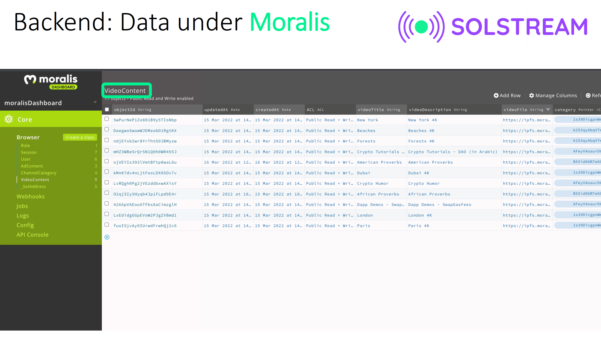
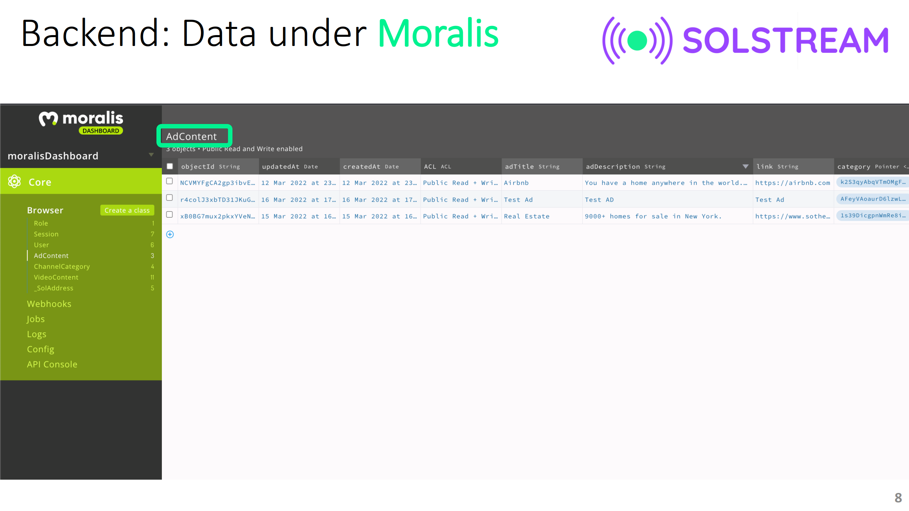

 

## Backend 

Currently, the only smart contract is for issuing a token for Governors.

Data regarding the uploaded videos and advertisements are stored through Moralis. Video files are stored on IPFS. The following two screenshots from Moralis show how the VideoContent and AdContent are stored.

 
 

The full set of tools used in the backend are described in the [Technology/Tool Stack](TechnologyStack.md) section.
    
**Index**

1. [Background](Background.md)
2. [Unique Value Offerings](UniqueValueOfferings.md)
3. [Design Principles](DesignPrinciples.md)
4. [System Architecture](SystemArchitecture.md)
5. **Backend**
6. [Frontend](Frontend.md)
7. [Technology/Tool Stack](TechnologyStack.md)
8. [Related Projects](RelatedProjects.md)
9. [Other Resources](OtherResources.md)
10. [Future Plans](FuturePlans.md)

<hline></hline>

[Back to Main GitHub Page](../README.md) | [Back to Documentation Index Page](Documentation.md)
