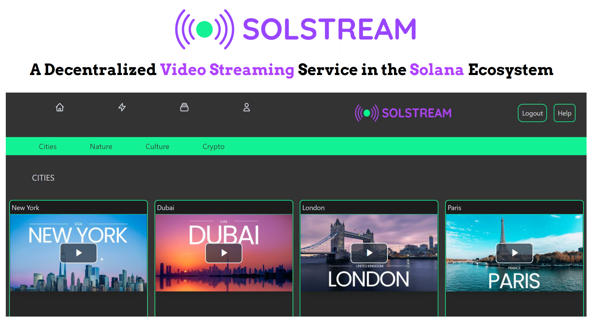
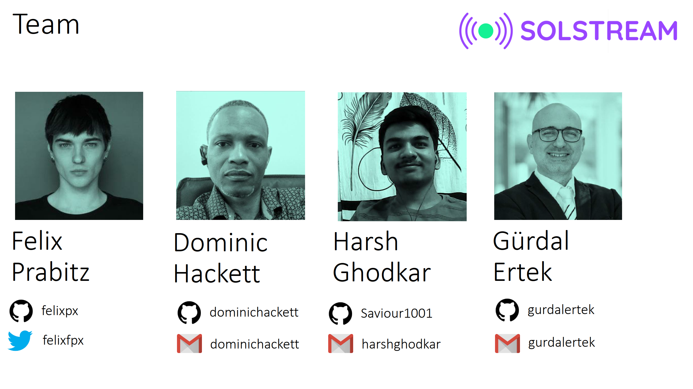

 

## A Decentralized Video Streaming Service in the Solana Ecosystem

[SOLSTREAM](https://solstream.co) is a **Decentralized Video Streaming** Service in the **Solana** Ecosystem.

This documentation presents details on the SOLSTREAM dapp and project.

## Start Here:

- [**SOLSTREAM Dapp**](https://solstream.co) is running live on the cloud.
- [**Source Code**](../README.md) is the GitHub repository for the dapp.
- [**YouTube Video**](https://youtu.be/SnNyCBWyJAc) is the demo video for the hackathon.

## Index

1. [Background](Background.md)
2. [Unique Value Offerings](UniqueValueOfferings.md)
3. [Design Principles](DesignPrinciples.md)
4. [System Architecture](SystemArchitecture.md)
5. [Backend](Backend.md)
6. [Frontend](Frontend.md)
7. [Technology/Tool Stack](TechnologyStack.md)
8. [Related Projects](RelatedProjects.md)
9. [Other Resources](OtherResources.md)
10. [Future Plans for Solstream](FuturePlans.md)

<hline></hline>

[Back to Main GitHub Page](../README.md) | [Back to Documentation Index Page](Documentation.md)

 

## Project Team

- [Felix Prabitz](https://github.com/felixpx/) (Frontend development, Smart contracts, UI design)

_New York, NY, USA_

- [Dominic Hackett](https://github.com/dominichackett)  (Backend development, Smart contracts, System design)

_Trinidad and Tobago_

- [Harsh Ghodkar](https://github.com/Saviour1001) (Backend development, Smart contracts)

_Mumbai, India_

- [Gurdal Ertek](https://github.com/gurdalertek) (System design, UI design, Content Development, System documentation)

_Al Ain, United Arab Emirates_

<!--- Member of [BlockBlockData](https://blockblockdata.com) Team; Associate Professor of Business Analytics, [UAE University](https://cbe.uaeu.ac.ae/en/departments/analytics/) --->

 
