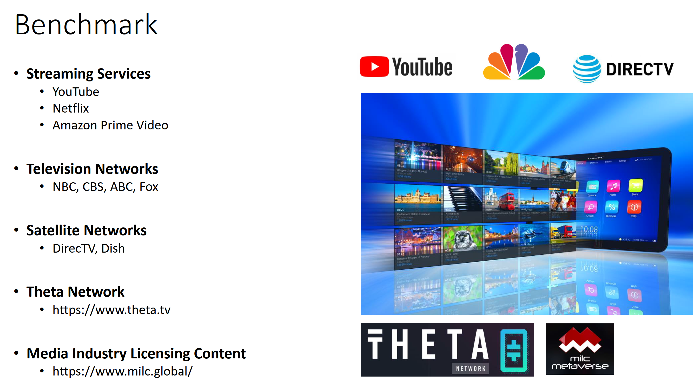

 

## Related Projects

### Benchmark with Competing Technologies/Platforms:

The following figure shows the benchmarks to the project (sans our last discovery, SoMee, which is mentioned in the text):

 

The following is a discussion of each benchmarked technology/platform, as some of the shortcomings of the existing technologies/platforms are to be resolved by SOLSTREAM:

**Streaming Services** 
- Built around on-demand video rather than live streaming, decisions/transactions not transparent, curation not democratized
	
**YouTube**
- Centralized, most of the profit goes to YouTube, advertisement exits but transactions not transparent, decisions/transactions not transparent,  while curation is democretized censoring rules are not transparent, YouTube's actions have significantly affected cryptocurrency content creators

**Television Networks**
- Centralized, decisions/transactions not transparent, curation not democratized

**Satellite Networks**
- Centralized, decisions/transactions not transparent, curation not democratized

**Theta Network**
- [https://www.thetatoken.org/](https://www.thetatoken.org/)
- Focuses on streaming, where there is no advertisement currently, very few (around 30-40) [streams](https://www.theta.tv/discover/streams) despite many years of presence, Theta ecosystem may change many things for the better.

**Media Industry Licensing Content**
[https://www.milc.global/](https://www.milc.global/)
- Tokenizing the media assets, but no advertisement aspects.
- Welt Der Wunder TV’s Media Content Library was valued by Ernst & Young at €48,000,000 in November 2020. 

**Somee** 
[https://somee.social/](https://somee.social/)
- Branded as "Social Media Redefined for privacy, end user control and monetization", Somee can be thought of as Facebook and YouTube on Web 3.0. 

**Index**

1. [Background](Background.md)
2. [Unique Value Offerings](UniqueValueOfferings.md)
3. [Design Principles](DesignPrinciples.md)
4. [System Architecture](SystemArchitecture.md)
5. [Backend](Backend.md)
6. [Frontend](Frontend.md)
7. [Technology/Tool Stack](TechnologyStack.md)
8. **Related Projects**
9. [Other Resources](OtherResources.md)
10. [Future Plans](FuturePlans.md)

<hline></hline>

[Back to Main GitHub Page](../README.md) | [Back to Documentation Index Page](Documentation.md)
