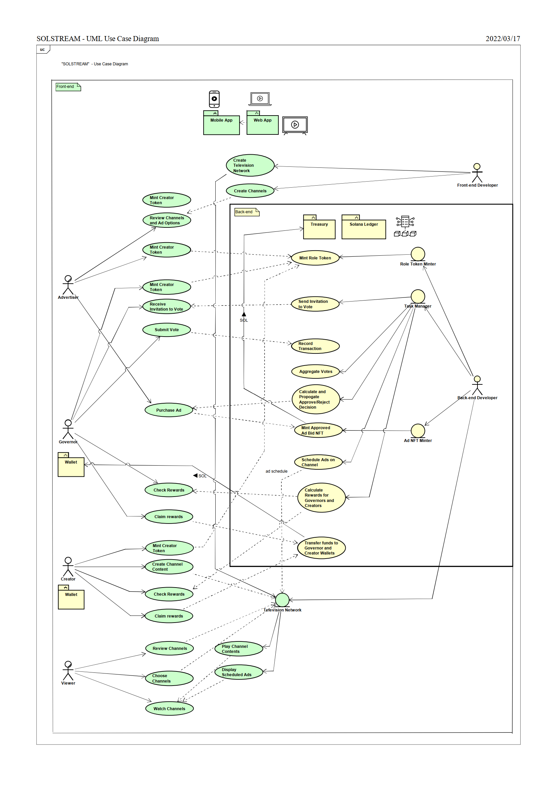
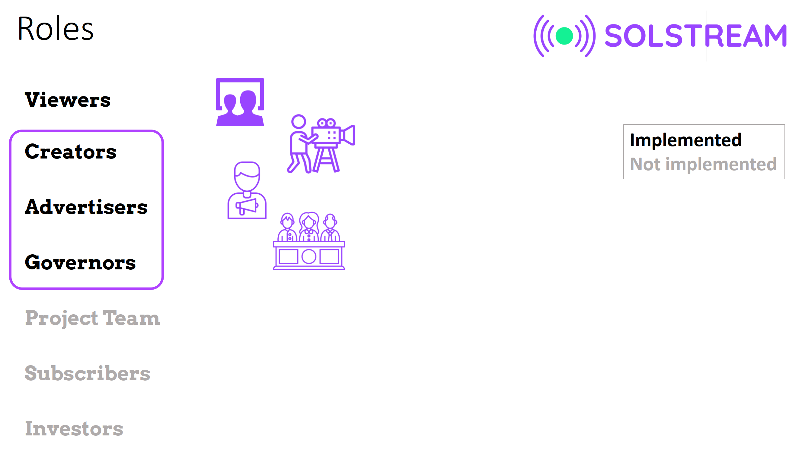

 

## System Architecture

The design of the system architecture is illustrated in the following figure as a [UML use case diagram](https://www.lucidchart.com/pages/uml-use-case-diagram). The diagram was created using [Astah Professional](https://astah.net/).

 

It should be noted that this is the design, yet not all of this design has been currently implemented. All smart functionality, except minting of role tokens, is currently not implemented, due to challenges faced with smart contracts in Solana.

###  Primary Functions of Agents/Actors/Stakeholders

 

**Viewers** watch for free free streaming TV channels (with advertisement).

**Creators** submit/get paid for copyrighted content as NFT.

**Advertisers** can purchase advertisement rights to their advertisement videos/messages as NFT (type of advertisement, number of times aired, date interval, times of day)

**Governors** receive royalties/use voting rights by serving on approval committees.

**Project Team (Future plan)** receive royalties/gain voting rights for developing the project into the future.

**Subscribers (Future plan)** watch for free free streaming TV channels without advertisement.

**Investors (Future plan)** purchase and get royalties/voting rights for Channel/Network Shares as NFT.

**System** coordinates all the events, contracts, advertisements, DAO, and other components.

###  Use Cases and Flows for Agents/Actors/Stakeholders

**Viewers**
1. Browse to the website
2. View available channels recommended
3. Choose streaming channel of their choice 
4. Watch for free, but with advertisements

**Creators**
1. Browse to the website
2. Sign-in by connecting their Web3 wallet
3. Choose "Creators" link.  (currently click the "Upload" icon, and select )
4. See accumulated rewards and channels available.
5. Video Submission Subflow:
6. 	Choose the channel to submit video to.
7. 	Upload the video
8. 	Wait until governors make a decision (approve/decline with feedback).
9. 	If approved, pay with Solana (SOL) for the approved creator royalty contract to be recorded as NFT, which is added to the creator's wallet.
10. Reward Collection Subflow:
		Pay with Solana (SOL) to collect the accumulated rewards, which is to be recorded as a transaction, where Solana (SOL) tokens are added to the creators's wallet.

**Advertisers**
1. Browse to the website
2. Sign-in by connecting their Web3 wallet
3. Choose "Advertisers" link.
4. Choose the channel to advertise in.
5. Analyze the costs of advertisement for standard ad durations.
6. Select other parameters and submit the bid the content to obtain advertisement rights as NFT.
7. Pay with Solana (SOL) for the bid to be recorded as NFT, which is added to the advertiser's wallet.
8. Wait until governers make a decision (approve/decline with feedback).
9. If approved, in addition to the existing parameters of the bid NFT, select number of times aired and date interval. 
10. Pay with Solana (SOL) for the approved advertisement contract to be recorded as NFT, which is added to the advertiser's wallet.

**Governors**
1. Browse to the website
2. Sign-in by connecting their Web3 wallet
3. Choose "Governors" link.
4. See accumulated rewards and assigned voting tasks, with strict time deadlines.
5. Voting Subflow:
For creator/advertiser approvals, and other yes/no decisions, vote for approval/rejection, with possible feedback.
Pay with Solana (SOL) for the bid to be recorded as NFT, which is added to the governor's wallet.
6. Reward Collection Subflow:
Pay with Solana (SOL) to collect the accumulated rewards, which is to be recorded as a transaction, where Solana (SOL) tokens are added to the governor's wallet.
		

**Project Team (Future plan)**

As described in the UML use case diagram above, buidl and maintain the system.

**Subscribers (Future plan)**

Same as viewers, except that they do not see the advertisements. There can also be other benefits of being a subscriber.

**Investors (Future plan)**

Purchase and get royalties/voting rights for Channel/Network Shares as NFT.

**System**
1. Regularly scan for the latest Creator and Advertisor bid NFTs 
2. If new bid NFTs exist, assign them to governors with a time limit.
3. Execute Smart Contracts

**Index**

1. [Background](Background.md)
2. [Unique Value Offerings](UniqueValueOfferings.md)
3. [Design Principles](DesignPrinciples.md)
4. **System Architecture**
5. [Backend](Backend.md)
6. [Frontend](Frontend.md)
7. [Technology/Tool Stack](TechnologyStack.md)
8. [Related Projects](RelatedProjects.md)
9. [Other Resources](OtherResources.md)
10. [Future Plans](FuturePlans.md)

<hline></hline>

[Back to Main GitHub Page](../README.md) | [Back to Documentation Index Page](Documentation.md)
